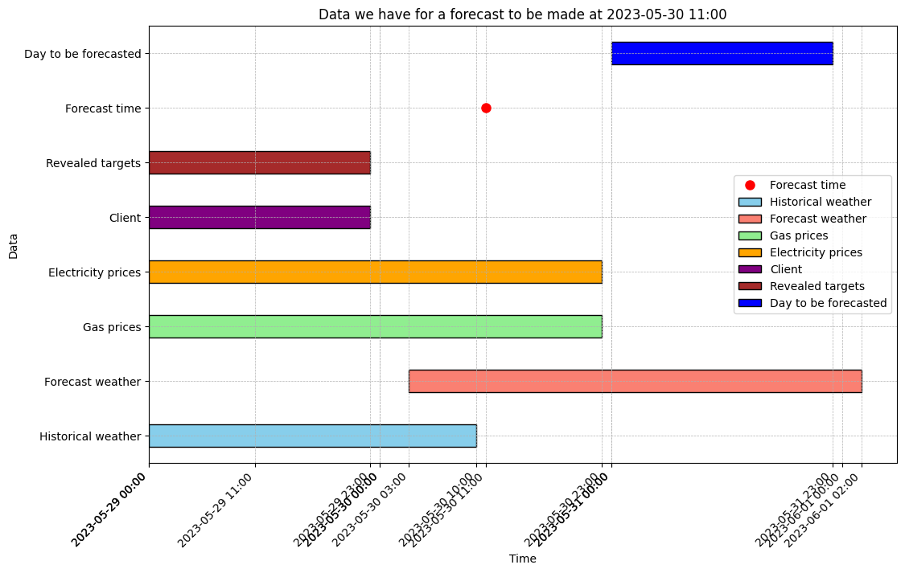
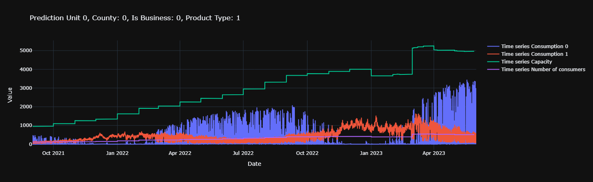

# Βασικά στοιχεία της Ανάλυσης του estonia_eda.ipynb

### **1. Φόρτωση Δεδομένων και Δομή**

- Τα περιεχόμενα των αρχείων που φορτώνονται:
    - **Training data** (`df_train`): Περιέχει την μεταβλητή στόχο target με τιμές παραγωγής/κατανάλωσης
    - **Client data** (`df_client`): Πληροφορίες για παραγωγούς-καταναλωτές
    - **Weather data**: Προβλέψεις καιρού και ιστορικά δεδομένα καρού
    - **Price data**: Τιμές ηλεκτρικής ενέργειας
    - **Weather station mappings**: Αντιστοίχιση μετεωρολογικών σταθμών και counties

### **2. Μέθοδοι προεπεξεργασίας Χρονοσειρών**

- **Data imputation**: Αντικατάσταση ελλειπούσων τιμών με μέσους όρους ιστορικών τιμών και παρεμβολή α
- **Remove outliers**: Αφαίρεση ανώμαλων και ακραίων τιμών με βάση τα στατιστικά όρια των δεδομένων
- **Time series conversion**: Μετατροπή στο κατάλληλο format
- **Calendar feature engineering**: Δημιουργία χαρακτηριστικών ημερολογίου (χρόνος, μήνας. ημέρα της εβδομάδας κ.α) για χρήση ως covariates

### **3. Κατανόηση Δεδομένων και Οπτικοποίηση**

- **Timeline analysis**: Κατανόηση της ροής διαθεσιμότητας των δεδομένων για πρόβλεψη και της τιμής `data_block_id`
- **Gantt chart visualization**: Παρουσιάζεται η προσωρινή διαθεσιμότητα διαφορετικών χαρακτηριστικών των δεδομέων για μία χρονική στιγμή
    
    
    
- **Time series plotting**: Οπτικοποίηση των μοτίβων κατανάλωσης/παραγωγής ενέργειας
    
    
    

### **4. Εξαγωγή Χαρακτηριστικών**

- **Static features**: County, business type, product type, is_consumption
- **Past covariates**: Ιστορικά δεδομένα καιρού, τιμές  ηλεκτρικης ενέργειας, capacity πελατών, αριθμός καταναλωτών
- **Future covariates**: Μετεωρολογικές προβλέψεις, στατικά χαρακτηριστικά

### **5. Σωλήνωση προεπεξεργασίας Δεδομένων (pipeline)**

- **Φόρτωση Δεδομένων**
- **Επικύρωση και έλεγχος ποιότητας:** διαθέσιμα data_block_id, NaN τιμές, duplicates, date range
- **Κανονικοποίηση**:
    - (is_consumption=1): Divide by `eic_count` (number of consumers)
    - (is_consumption=0): Divide by `installed_capacity` (PV capacity)
- **Εντοπισμός ακραίων τιμών και αφαίρεση:** όριο από std
- **Αντικατάσταση ελλειπουσών τιμών:** `impute()`
- **Προσθήκη χρονικών χαρακτηριστικών:** `create_calendar()`, `get_time_covariates()`
- **Επεξεργασία Δεδομένων Καιρού:** Geographic Mapping, Historical Weather Covariates, Weather Forecast Covariates
- **Επεξεργασία Δεδομένων της Αγοράς:** Electricity Prices, Gas Prices
- **Δημιουργία Static Covariates:**
    - County ID
    - Business type indicator
    - Product type
    - is_consumption
- **Τελική εξαγωγή Δεδομένων:**
    
    Από την διαδικασία αυτή εξάγονται τα  αρχεία:
    
    - raw_series_normalised.csv
    - raw_past_covs_client_elec_prices.csv
    - raw_future_covs_weather.csv
    - raw_static_as_future_covs.csv
    - raw_future_covs.csv