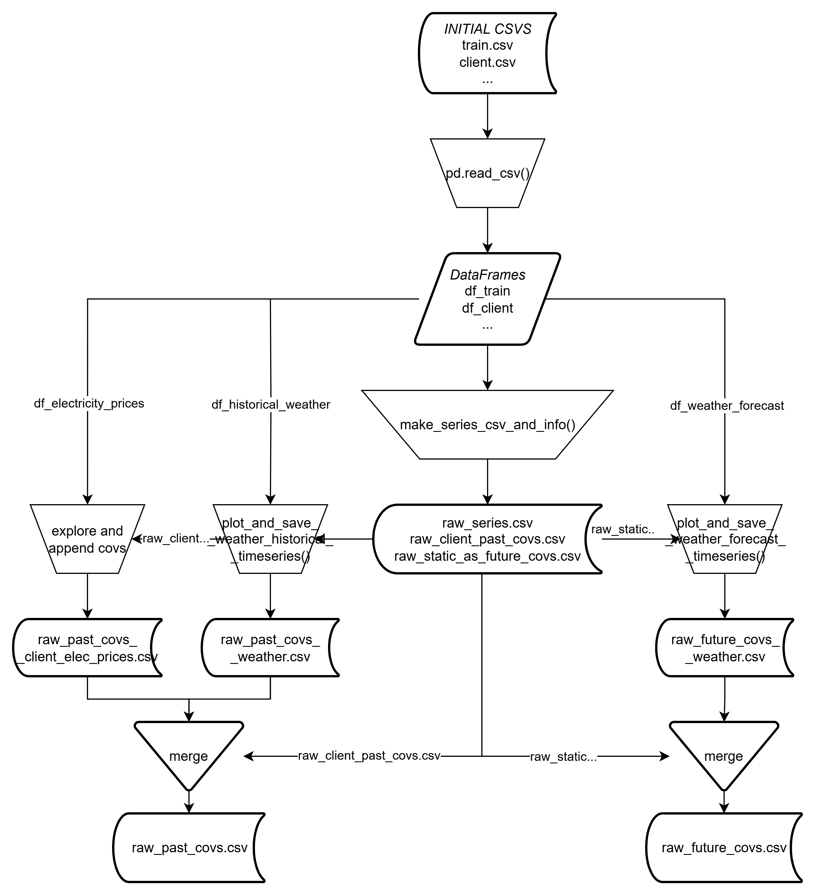

# Pipeline

1. **Φόρτωση Δεδομένων** 
    1. `pandas.read_csv()` : Φόρτωση όλων των csv αρχείων σε DataFrame
2. **Ανάλυση**
3. **Μετασχηματισμός Δεδομένων**
    
    `make_series_csv_and_info()`: Η συνάρτηση ουσιαστικά μετατρέπει τα ακατέργαστα δεδομένα της αγοράς ενέργειας σε μια δομημένη μορφή που  μπορούν να χρησιμοποιούν πολλαπλούς τύπους covariates (παρελθοντικών και μελλοντικών) παράλληλα με την κύρια σειρά-στόχο. Έτσι παράγει τρία ξεχωριστά csv αρχεία για αρχή και στην συνέχεια τα εμπλουτίζει με covariates.
    
    1. raw_series.csv: Βασική χρονοσειρά στόχος
    2. raw_client_past_covs.csv: Παρελθοντικά covariates
    3. raw_static_as_future_covs.csv: Μελλοντικά covariates
    
    **Για κάθε ξεχωριστό prediction_unit_id** δημιουργούνται οι χρονοσειρές που περιέχουν τα χαρακτηριστικά:
    
    - Consumption data (`is_consumption == 1`)
    - Production data (`is_consumption == 0`)
    - Capacity
    - Number of Consumers: Αριθμός καταναλωτών (`eic_count`) από το client dataset
    
    **Επαναδειγματοληψία** σε διαστήματα 1h για όλες τις χρονοσειρές 
    
    **Δημιουργία static covariates**, δηλαδή χαρακτηριστικών τα οποία παραμένουν σταθερά στον χρόνο
    
    - County
    - Business type
    - Product type
    - Consumption/Production flag
    
     **Οργάνωση Δεδομένων,** οι χρονοσειρές αναλόγως την κατηγορία τους για να αποθηκευτούν σε αρχεία αποκτούν την παρακάτω δομή.
    
    - Βασικές Χρονοσειρές (raw_series) έχουν ID:
        
        `U{unit}C{county}B{business}P{product}Pr` αν αφορά Production
        
        `U{unit}C{county}B{business}P{product}Cs` αν αφορά Consumption
        
        Χρησιμοποείται timeseries_id:  <Unit> για production, <Unit> + 100 για consumption
        
    - Χρονοσειρές Covariates (past & future):
        
        `U{unit}C{county}B{business}P{product}Pr|Cs{Pr|Cs}{Cov}`
        
        Τα covariates που χρησιμοποιούνται είναι:
        
        | Future | Past |
        | --- | --- |
        | temperature: T | temperature: T |
        | dewpoint: Dp | dewpoint: Dp |
        | cloudcover_total: Cl | cloudcover_total: Cl |
        | 10_metre_u_wind_component: Wu | windspeed_10m: W |
        | 10_metre_v_wind_component: Wv | — |
        | direct_solar_radiation: Dr | direct_solar_radiation: Drr |
        | surface_solar_radiation_downwards: Sr | shortwave_radiation: Sr |
        | snowfall: Sn | snowfall: Sn |
        | total_precipitation: Pr | rain: Pr |
        | Static County: SC | — |
        | Static Business: SB | — |
        | Static Product type: SP | — |
        | Static consumption / production: SCP | — |
        | — | diffuse_radiation: Dfr |
        | — | Capacity: PrCpy |
        | — | Costumer Count: CsCnt |
        | — | Electricity Price: ElPr |
4. **Άνοιγμα/Αποθήκευση αρχείων**
    
    `multiple_ts_file_to_dfs`: Διαβάζει ως είσοδο ένα csv αρχείο με pandas.read_csv() το οποίο περιέχει πολλαπλές χρονοσειρές και επιστρέφει δομημημένα DataFramers σε μία τούπλα με τρείς  λίστες από λίστες που περιέχουν τα DataFrames των χρονοσειρών (res), τα ids του κάθε component της χρονοσειράς (id_l) και τα ids της χρονοσειράς (ts_id_l) 
    
    `multiple_dfs_to_ts_file`: Είναι η αντίστροφη διαδικασία της πάνω μεθόδου
    
5. **Προσθήκη covariates**
    1. `plot_and_save_weather_historical_timeseries()`
    2. `plot_and_save_weather_forecast_timeseris()`
    3. Προσθήκη τιμών ηλεκτρικής ενέργειας `CsElPr` και `PrElPr`
6. **Αφαίρεση προβληματικών σειρών**
    
    Αφαίρεση σειρών με πολλές NaN τιμές
    
7. **Ανίχνευση/Αφαίρεση ακραίων τιμών**
    
    `remove_outliers()`: Ανίχνευση και αφαίρεση όλων των τιμών που υπερβάινουν την std_dev* τυπική απόκλιση των μηνιαίων μέσων τιμών
    
8. **Αντικατάσταση αγνώστων τιμών** 
    
    `impute()` : Η συνάρτηση αυτή αντικαθιστά NaN τιμές χρησιμοποιώντας σταθμισμένους μέσους όρους ιστορικών δεδομένων και γραμμικής παρεμβολής. Αν οι συνεχόμενες NaN τιμές υπερβαίνουν το όριο max_thr που δίνεται ως παράμετρος τότε η αντικατάσταση δεν γίνεται. Τα βάρη εξαρτώνται από την απόσταση που έχει η NaN τιμή από την πλησιέστερη μη-άγνωστη τιμή στην Χρονοσειρά.
    
9. **Shift**

Στο παρακάτω flowchart φαίνεται η διαδικασία της παραγωγής των βασικών αρχείων της προεπεξεργασίας.

EDA part1

EDA part2

